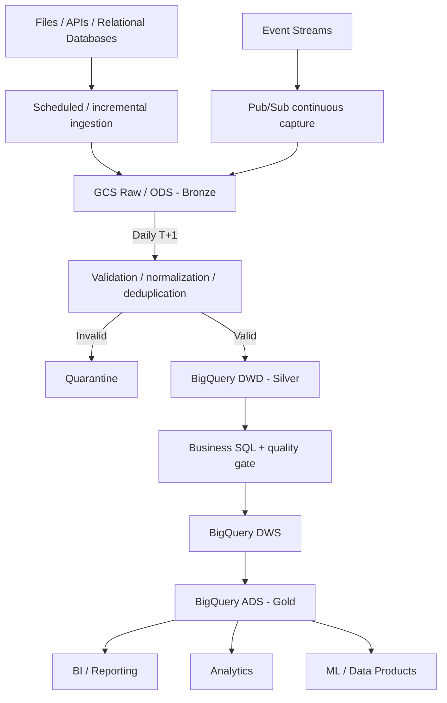

# Event Data Product - Principal Data Engineer Take-Home

## Solution scope

This submission has two deliberately separate parts:

1. **Runnable local implementation:** a standard-library Python component that demonstrates landed **Raw / ODS to DWD (Silver)** processing: read, normalize, validate, deduplicate, quarantine, and write canonical event detail.
2. **Production reference design:** a GCP, T+1 architecture from source ingestion through **Raw / ODS (Bronze), DWD (Silver), DWS, and ADS (Gold)** to analytical consumers.

`data/input/events.json` simulates data already landed at the Raw/ODS boundary. The local output is named `data/output/curated/events.jsonl` because the assessment asks for a curated analytical output, but semantically it is canonical DWD/Silver detail. DWS and ADS/Gold models are not implemented locally because the assessment does not provide the business requirements needed to design them responsibly.

All sample data is synthetic. No GCP service or deployment pipeline has been provisioned, and the repository contains no credentials or real customer data.

## Assessment assumptions

The prompt does not specify cloud, volume, SLA, or infrastructure constraints. The architecture therefore uses these explicit assessment assumptions:

- GCP is the target cloud.
- Sources are structured files, APIs, relational databases, and event streams.
- Event streams may be captured continuously, but analytical publication is not initially real time.
- New data volume is approximately 50-200 GB per day.
- Processing is incremental T+1 batch, with previous business-day ADS/Gold data available by an agreed next-morning SLA, for example 06:00 in the business timezone.
- Records may arrive after the normal cutoff, and Raw data must be retained for replay, audit, and backfill.
- Some customer identifiers may be sensitive.
- A small-to-medium data engineering team maintains isolated dev, test, and prod environments.
- Managed/serverless services are preferred to reduce operational burden.

## Quick start

Python 3.10+:

```bash
python -m src.main --input data/input/events.json --output data/output
```

Run tests:

```bash
python -m pytest
```

## Architecture choices and trade-offs

### Production reference architecture



GCS is the durable, source-faithful replay boundary. BigQuery provides managed analytical storage, set-based transformations, incremental `MERGE` or partition processing, and serving. Cloud Composer/Airflow orchestrates the daily workflow; Cloud Logging and Cloud Monitoring support operations; IAM, Secret Manager, and Cloud Audit Logs support security and auditability.

Ingestion is source-aware rather than one-size-fits-all:

- Files land as immutable daily objects in GCS Raw/ODS.
- APIs are requested by logical `process_date` where supported, using source-specific pagination or cursors only when required.
- Databases are extracted incrementally by business date, `updated_at`, or CDC where appropriate.
- Pub/Sub captures event streams continuously into replayable GCS data, while downstream analytical processing remains T+1.

Ingestion latency and analytical freshness are separate concerns: capturing an event quickly does not require publishing analytical models in real time.

### Managed vs. self-managed

Under the stated assumptions, managed/serverless services reduce provisioning, scaling, patching, high-availability work, and on-call burden for a small-to-medium team. The trade-off is greater GCP dependency, less infrastructure-level control, and lower portability.

Self-managed or more open infrastructure may make sense when runtime control, portability, multi-cloud requirements, or measured cost/performance benefits justify its additional operational burden. Neither approach is universally superior.

### Batch vs. streaming

T+1 batch is chosen because the assumed SLA does not require real-time analytics. It is simpler and generally cheaper to operate, replay, and backfill; the trade-off is freshness. If hourly freshness becomes necessary, first shorten the logical batch interval and retain incremental processing. Introduce a true streaming transformation path only when seconds/minutes latency is justified by a real business use case.

## Data modeling decisions

| Layer | Decision |
| --- | --- |
| Raw / ODS (Bronze) | Source-faithful, immutable GCS data used for replay, audit, and backfill |
| DWD (Silver) | Canonical typed event detail after normalization, validation, and deduplication, including business keys and traceability |
| DWS | Reusable business-oriented aggregates; specific models are deferred until real metrics and use cases are known |
| ADS (Gold) | Consumer-facing datasets for BI, reporting, analytics, ML features, or data products |

The DWD event dataset is fact-like and keeps the canonical event grain. Dimensions, star-schema marts, or wider serving tables would be introduced only after understanding real consumer access patterns and business metrics. Reusable dimensions may be appropriate for shared entities, while ADS datasets may deliberately denormalize data for BI or ML consumption.

Event/business date is the natural partition boundary for T+1 processing, targeted reruns, and late-data correction. In the demo, `event_id` is the assumed business key. For duplicates, the greatest `ingestion_timestamp` wins; an input-row position breaks timestamp ties. This is an explicit source-semantic assumption, not a universal deduplication rule. An immutable versioned source might instead use `(event_id, event_version)`.

The local JSON demo uses Python numeric values for simplicity. Production monetary fields should use fixed precision such as BigQuery `NUMERIC`/`DECIMAL`, or integer minor units where the domain requires them.

## Python implementation and code structure

The runnable flow is intentionally direct:

```text
read -> normalize -> validate -> deduplicate -> quarantine invalid/superseded rows
     -> deterministic atomic write
```

| Module | Responsibility |
| --- | --- |
| `src/main.py` | CLI, stage coordination, logging, summary, and expected top-level failures |
| `src/reader.py` | JSON array/JSONL reading, missing/empty file handling, and row-level JSONL parse errors |
| `src/transformer.py` | Canonical text/timestamp/amount transformations and deterministic deduplication |
| `src/validator.py` | Required fields, types, supported currencies, timestamps, and value constraints |
| `src/writer.py` | Deterministic JSON/JSONL serialization and atomic file replacement |

The reader can quarantine an individual malformed JSONL row and continue. A malformed JSON array fails because its record boundaries cannot be recovered safely. Stable input produces byte-identical output with no hidden state or run-time fields. Canonical rows include `_source_file` and `_source_row`; quarantine retains the original record and all rejection reasons.

This implementation demonstrates the processing contract and engineering behavior; it is not intended to process 50-200 GB per day in memory on one machine. At production scale, set-based work should run in BigQuery where appropriate. Managed distributed compute such as Dataflow can be considered for complex parsing or transformations that are not a good fit for SQL.

## Data quality strategy

The local contract requires:

| Field | Rule and normalization |
| --- | --- |
| `event_id` | non-empty string; trim; unique after deduplication |
| `source_system` | non-empty string; trim and lowercase; spaces/hyphens become `_` |
| `customer_id` | non-empty string; trim |
| `event_type` | non-empty string; trim and lowercase; spaces/hyphens become `_` |
| `event_timestamp` | timezone-aware ISO-8601 string; normalize to UTC `Z` |
| `amount` | finite, non-negative JSON number; normalize to two decimal places |
| `currency` | accepted value: USD, EUR, GBP, CAD, AUD, or JPY; uppercase |
| `ingestion_timestamp` | timezone-aware ISO-8601 string; normalize to UTC `Z` |

Production quality checks extend this with duplicate-rate monitoring, referential integrity where applicable, quarantine rate, source-to-target row-count reconciliation, input/output volume, and freshness. BigQuery SQL checks should act as publication gates: critical dataset-level failures block DWS/ADS publication rather than allowing untrusted data to reach consumers.

For schema evolution, additive backward-compatible optional fields can normally be accepted without breaking existing consumers. Breaking changes such as renamed fields, incompatible type changes, or changed semantics require a new contract version and compatibility testing before promotion.

## Failure handling, retries, and reprocessing

```text
detect -> quarantine or fail -> alert -> diagnose -> retry/reprocess -> validate recovery
```

- **Recoverable record error:** quarantine the row with source metadata and reasons; continue processing valid rows.
- **Unsafe dataset failure:** incompatible schema, corrupt input, or failed reconciliation fails the run and blocks publication.
- **Transient service/network failure:** the illustrative DAG retries twice with a fixed five-minute delay.
- **Deterministic data/schema/code failure:** do not repeatedly retry; diagnose and correct data, configuration, or code, then rerun.

Airflow supplies a logical `process_date`, for example `2026-09-01`. A rerun uses the same date and deterministically rebuilds or merges that business interval. Production publication uses a business-key BigQuery `MERGE` for corrected rows or controlled replacement of the affected partition when simpler and safer; it never blindly appends another copy.

Historical backfills call the same date-parameterized logic as scheduled runs. A late record lands in immutable Raw data, identifies its event/business date, triggers a merge or partition recomputation in DWD, and recomputes dependent DWS/ADS partitions before quality checks and corrected publication.

## Orchestration and CI/CD approach

Composer/Airflow is the control plane, not the compute engine. The illustrative DAG coordinates:

```text
ingest -> validate -> transform_dwd -> quality_check
       -> transform_dws -> transform_ads -> publish -> freshness_check
```

`process_date` comes from Airflow's logical data interval rather than `datetime.now()`, making retries and historical backfills deterministic. `catchup=True` enables controlled backfills, `max_active_runs=1` avoids conflicting publication, and quality checks gate downstream work. The example SLO is previous business-day ADS/Gold published before 06:00 next morning in the business timezone.

CI is implemented; CD is conceptual:

- GitHub Actions runs on pull requests targeting `main` and pushes to `main`. It installs dependencies, checks lint/format, runs pytest and the sample pipeline, builds version `0.1.0` as wheel and source distribution, and uploads `dist/` as a commit-SHA-named artifact.
- Pull-request CI is the intended pre-merge quality gate; `main` CI validates the final merged state. A production repository would configure branch protection and required status checks so CI must pass before merge.
- GitLab CI mirrors validation and real package building. Its dev/test/prod jobs are explicitly conceptual; no GCP deployment or credentials are implemented. Real production promotion would reuse the tested immutable version and require manual approval.

## Security, governance, privacy, and access controls

- Use dedicated least-privilege service accounts for ingestion, transformation, and consumers.
- Isolate dev, test, and prod with separate projects or strongly separated datasets and identities.
- Restrict Raw/ODS and quarantine access; use BigQuery dataset, table, row, and column controls or masking for sensitive fields where appropriate.
- Keep secrets outside code in Secret Manager or protected CI variables; prefer short-lived identity federation over stored service-account keys.
- Use encryption in transit and at rest through GCP-managed encryption by default, with customer-managed keys considered where organizational policy requires additional key control.
- Retain source object, business date, run ID, code/config version, target partition, owner, and SLO for auditability and lineage. OpenLineage is an option, not a required dependency.
- Apply retention and deletion policies to GCS, BigQuery, staging, quarantine, logs, and backups without inventing regulatory requirements not stated in the assessment.

## Cost and performance optimization

- Partition BigQuery tables on useful date/timestamp boundaries and add clustering only when measured query patterns justify it.
- Process incrementally and rebuild only affected business-date partitions rather than performing unnecessary full refreshes.
- Avoid unnecessary `SELECT *`, prune partitions, and monitor bytes processed, query cost, and pipeline duration.
- Materialize reusable DWS/ADS results when repeated consumption justifies their storage and maintenance cost.
- Use managed/serverless compute to avoid idle infrastructure and apply GCS lifecycle rules under replay and retention requirements.

BigQuery supports multi-terabyte analytical workloads; volume alone is not a reason to replace it. The local Python process is deliberately not the production engine for 50-200 GB/day.

## Evolution to broader organizational scale

1. **Data-volume scale:** improve partitioning and clustering, parallelize source ingestion, keep transformations in BigQuery or appropriate managed distributed processing, and isolate workloads where contention requires it.
2. **Freshness scale:** begin with T+1, shorten batch intervals when needed, and add selected streaming transformation paths only for justified seconds/minutes use cases.
3. **Organizational scale:** provide reusable pipeline and DAG templates, versioned input schemas/data contracts, standardized CI/CD and SLOs, clear ownership, centralized observability, lineage/catalog/governance conventions, access-control patterns, runbooks, and self-service onboarding for new data products.

Organizational scale is not only a compute-scaling problem. The next practical increments are to version the input schema and test upstream sample data against it to catch breaking changes early; add isolated GCS/BigQuery integration tests; implement only consumer-approved DWS/ADS models; and exercise late-data, backfill, recovery, and access-control runbooks.

## What is implemented vs. reference design

Actually runnable and implemented:

- Local JSON/JSONL Python processing, validation, normalization, deduplication, quarantine, logging, and atomic output.
- Eight pytest tests, including end-to-end idempotency.
- GitHub and GitLab validation plus versioned Python wheel/source-distribution builds.

Reference or conceptual only:

- Source ingestion and real GCP infrastructure deployment.
- Production Composer environment and BigQuery DWD/DWS/ADS models.
- Cloud monitoring, alerting, lineage, and production security integrations.
- Functional dev/test/prod deployment and infrastructure provisioning.

## Run locally

Python 3.10+ is required. The runtime pipeline uses only the Python standard library.

```bash
python -m src.main --input data/input/events.json --output data/output
```

Expected summary:

```text
Completed: input=7 curated=2 quarantined=5 duplicates=1
```

The command atomically generates `data/output/curated/events.jsonl`, `data/output/quarantine/events.jsonl`, and `data/output/run_summary.json`. Generated output is excluded from version control.

Install development tools and run all checks/builds with:

```bash
python -m pip install -r requirements-dev.txt
ruff check src tests
ruff format --check src tests
python -m pytest
python -m src.main --input data/input/events.json --output data/output
python -m build
```

The build creates `dist/event_data_product_pipeline-0.1.0-py3-none-any.whl` and `dist/event_data_product_pipeline-0.1.0.tar.gz`.

## Repository structure

```text
.
|-- .github/workflows/ci.yml             # executable GitHub CI
|-- .gitlab-ci.yml                       # validation/build plus conceptual CD
|-- README.md
|-- data/input/events.json               # synthetic Raw/ODS input
|-- docs/architecture.md                 # detailed production reference design
|-- orchestration/event_pipeline_dag.py  # illustrative Composer/Airflow DAG
|-- pyproject.toml                       # package metadata and tool configuration
|-- requirements-dev.txt
|-- src
|   |-- main.py
|   |-- reader.py
|   |-- transformer.py
|   |-- validator.py
|   `-- writer.py
`-- tests                                # unit and end-to-end tests
```
