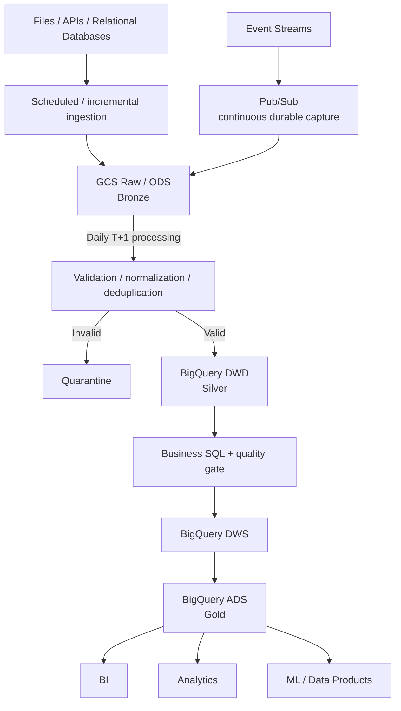

# Event Data Product - Principal Data Engineer Take-Home

This submission has two deliberately separate parts:

1. **A locally runnable Python component.** It demonstrates the boundary from landed **Raw / ODS to DWD (Silver)**: read, normalize, validate, deduplicate, quarantine, and write canonical event detail.
2. **A production reference architecture.** It describes a GCP, T+1 data platform from source ingestion through **Raw / ODS (Bronze), DWD (Silver), DWS, and ADS (Gold)** to consumers.

The local demo is intentionally narrower than the production design. `data/input/events.json` simulates data already landed at the Raw/ODS boundary. The output is named `data/output/curated/events.jsonl` because the assessment asks for a curated analytical output, but semantically it is closest to canonical DWD/Silver detail. DWS and ADS/Gold business models are design-only because they should come from validated consumer requirements, not invented requirements for this exercise.

All sample data is synthetic. No GCP service has been deployed, and the repository contains no credentials or real customer data.

## What is implemented

- Standard-library Python separated into reading, normalization, validation, deduplication, and atomic writing modules.
- JSON array and JSONL input, including recoverable malformed JSONL rows.
- Record-level quarantine with all rejection reasons and source position.
- Deterministic latest-ingestion-wins deduplication and byte-identical reruns.
- Eight pytest tests covering validation, normalization, malformed input, missing files, deduplication, and end-to-end idempotency.

The GCP services, BigQuery models, Cloud Composer runtime, monitoring/lineage integrations, security controls, and deployment jobs described below are **reference design only**. The DAG and GitLab pipeline are lightweight examples.

## Run locally

Python 3.10+ is required. The runtime pipeline uses only the Python standard library.

```bash
python -m src.main --input data/input/events.json --output data/output
```

Expected log summary:

```text
Completed: input=7 curated=2 quarantined=5 duplicates=1
```

The command generates and atomically replaces:

- `data/output/curated/events.jsonl` - two normalized, unique canonical events.
- `data/output/quarantine/events.jsonl` - one superseded duplicate and four invalid records, with reasons and source positions.
- `data/output/run_summary.json` - deterministic counts suitable for automation.

Generated outputs are excluded from version control. Install development tools and run checks with:

```bash
python -m pip install -r requirements-dev.txt
python -m pytest
ruff check src tests
ruff format --check src tests
python -m build
```

The build command creates a versioned wheel and source distribution under `dist/`, for example `event_data_product_pipeline-0.1.0-py3-none-any.whl` and `event_data_product_pipeline-0.1.0.tar.gz`.

## Repository structure

```text
.
|-- .github/workflows/ci.yml                        # executable GitHub CI
|-- .gitlab-ci.yml
|-- Principal_Data_Engineer_Candidate_Take_Home.md  # original, unchanged
|-- README.md
|-- data/input/events.json                          # synthetic Raw/ODS input
|-- docs/architecture.md                            # detailed production design
|-- orchestration/event_pipeline_dag.py             # illustrative Composer/Airflow DAG
|-- src
|   |-- main.py                                     # CLI and pipeline flow
|   |-- reader.py                                   # JSON/JSONL input and parse errors
|   |-- transformer.py                              # normalization and deduplication
|   |-- validator.py                                # record contract
|   `-- writer.py                                   # atomic deterministic output
`-- tests                                           # unit and end-to-end tests
```

## Local data contract

The reader accepts a JSON array or newline-delimited JSON. A malformed JSONL line is quarantined while other rows continue. A malformed JSON array is a dataset-level failure because record boundaries cannot be recovered safely. Missing, empty, or unreadable files fail with a non-zero exit code.

| Field | Rule | Normalization |
| --- | --- | --- |
| `event_id` | non-empty string, unique after deduplication | trim |
| `source_system` | non-empty string | trim, lowercase, spaces/hyphens to `_` |
| `customer_id` | non-empty string | trim |
| `event_type` | non-empty string | trim, lowercase, spaces/hyphens to `_` |
| `event_timestamp` | ISO-8601 string with timezone | convert to UTC `Z` |
| `amount` | finite, non-negative JSON number; numeric text is invalid | two-decimal numeric representation |
| `currency` | USD, EUR, GBP, CAD, AUD, or JPY | trim, uppercase |
| `ingestion_timestamp` | ISO-8601 string with timezone | convert to UTC `Z` |

Validation reports all violations for a record. Unexpected fields are tolerated for backward-compatible additive evolution but omitted from the canonical output. A production contract would govern compatibility explicitly.

### Deterministic deduplication

For a repeated `event_id`, keep the record with the greatest normalized `ingestion_timestamp`. If timestamps tie, the later input row wins. Superseded rows go to quarantine with the winning row number. This assumes an event ID represents one mutable business event and later ingestion carries the authoritative correction. An immutable versioned source would instead require a key such as `(event_id, event_version)`.

### Idempotency and traceability

Stable input produces byte-identical files; the pipeline adds no run-time values or hidden state. Each output is written to a temporary sibling, flushed, and atomically replaced, so a failed write does not expose a partial file. Canonical rows include `_source_file` and `_source_row`; quarantine retains the original record and all rejection reasons.

## Production reference architecture

Warehouse terminology is primary. Bronze/Silver/Gold appears in parentheses only to map the design to the assessment:

| Layer | Purpose |
| --- | --- |
| Raw / ODS (Bronze) | Source-faithful retained data and the replay/audit boundary in GCS |
| DWD (Silver) | Typed, normalized, validated, deduplicated event-level detail in BigQuery |
| DWS | Reusable subject-oriented aggregates, such as customer daily activity |
| ADS (Gold) | Consumer-specific datasets for dashboards, reports, analytics, ML features, or data products |



Cross-cutting components stay outside the main flow to keep the diagram readable: **Cloud Composer/Airflow** orchestrates the daily workflow; **Cloud Logging and Cloud Monitoring** provide operations; **IAM, Secret Manager, and Cloud Audit Logs** support security and auditability; and **GitLab CI** validates and promotes code. OpenLineage is one possible lineage standard, not a required dependency.

### Where the runnable Python demo fits

```text
Production: GCS Raw / ODS           -> processing boundary -> BigQuery DWD / Silver
Local:      data/input/events.json  -> Python pipeline     -> data/output/curated/events.jsonl
```

The demo proves the custom parsing, validation, normalization, deduplication, and quarantine rules. It does not implement source ingestion, BigQuery publication, or DWS/ADS transformations.

## Assessment assumptions

The original prompt does not specify cloud, volume, SLA, or infrastructure constraints. The following are explicit assumptions made for this reference architecture:

- Target cloud is GCP.
- Sources are structured files, APIs, relational databases, and event streams.
- Event streams may be captured continuously, but real-time analytical transformation and publication are not initial requirements.
- New data volume is approximately 50-200 GB per day.
- Processing is T+1 daily batch, using incremental extraction/loading where appropriate.
- Previous business-day ADS/Gold data is published by an agreed next-morning SLA, for example 06:00 in the business timezone.
- Records may arrive after the normal daily cutoff.
- Raw source data is retained for replay, audit, and backfill.
- Some customer identifiers may be sensitive.
- A small-to-medium data engineering team maintains the platform.
- Managed/serverless services are preferred to reduce operational burden.
- Dev, test, and prod are isolated environments.

These assumptions are design inputs, not requirements supplied by the assessment.

## Ingestion by source type

One connector pattern does not fit every source:

- **Files:** a source export lands as an immutable object in GCS Raw/ODS with source, business date, checksum, and arrival metadata.
- **APIs:** a scheduled Python ingestion job requests data for the logical `process_date` where the API supports it, using source-specific pagination or cursors only when that API requires them. It then writes GCS Raw or a controlled staging area. Composer orchestrates the job.
- **Relational databases:** extract incrementally using business date, `updated_at`, or CDC where appropriate for the source. Airflow's `process_date` defines the pipeline interval, and changes land in GCS Raw and/or BigQuery staging.
- **Event streams:** Pub/Sub provides continuous durable event capture, and an ingestion sink writes source-faithful, replayable objects to GCS Raw/ODS. The daily Composer run processes the bounded business-date interval from GCS; no real-time transformation path is required.

Ingestion latency and analytical freshness are separate concerns. Events can be captured continuously to reduce loss and decouple producers while DWD/DWS/ADS publication remains T+1.

## Daily T+1 processing and idempotency

Every run has a logical `process_date`, independent of wall-clock retry time. For example:

```text
process_date=2026-09-01

ingest relevant source data -> GCS Raw / ODS -> daily Composer DAG
                            -> BigQuery staging -> DWD -> DWS -> ADS
                            -> quality checks -> publish
```

T+1 does not mean full refresh. Files ingest only new daily objects; APIs request `process_date` and use source-specific pagination/cursors when necessary; databases filter by business date or `updated_at`, or use CDC where appropriate; and event streams process only the captured Raw objects for the bounded business-date interval. BigQuery DWD uses a business-key `MERGE` for correctable rows or controlled replacement of an affected business-date partition when that is simpler and safer. DWS/ADS recompute only impacted partitions where dependencies allow.

A production rerun follows:

```text
Immutable GCS Raw -> run-scoped staging -> validation and reconciliation
                  -> BigQuery MERGE or controlled partition replacement
                  -> quality gate -> publish
```

Rerunning the same `process_date` deterministically rebuilds or merges that interval; it never blindly appends a second copy. Publication happens only after quality checks succeed. When DWD changes, dependent DWS and ADS partitions are recomputed as required.

### Late-arriving data

T+1 does not remove late-data concerns. If an event for `business_date=2026-09-01` arrives after cutoff, it still lands in immutable GCS Raw. The pipeline identifies the affected date, merges the business key or reprocesses that DWD partition, recomputes affected DWS/ADS partitions, reruns quality and reconciliation checks, and publishes corrected data. Arrival lateness is measured so source behavior is visible.

## Technology choices and trade-offs

- **GCS:** durable, low-cost, source-faithful Raw/ODS storage and the replay/backfill boundary.
- **Pub/Sub:** durable ingestion for event-stream sources; captured events still join the daily GCS-to-BigQuery analytical path.
- **BigQuery:** managed/serverless DWD, DWS, and ADS storage, incremental `MERGE` or partition processing, SQL transformation, and analytical serving.
- **BigQuery SQL:** the clearest fit for relational joins, aggregations, window functions, and business models.
- **Python:** demonstrated locally and useful where parsing, validation, normalization, or other custom logic is clearer outside SQL.
- **Cloud Composer/Airflow:** daily scheduling, dependencies, retries, backfills, and freshness checks.
- **Cloud Logging/Monitoring:** centralized logs, metrics, dashboards, and alerts.
- **GitLab CI:** automated checks and controlled promotion of one immutable version.

Under the stated assumptions, a warehouse-centric design keeps operations low because consumers are primarily BI/analytics users and most downstream work is relational SQL. GCS still provides an independent durable Raw/replay layer. An open-table lakehouse becomes more attractive when multiple compute engines must share object-storage tables, open formats are a strategic requirement, or direct distributed lake access is primary. Neither model is universally superior.

## Data quality and failure handling

Checks cover required-field completeness, nullability, expected types, timestamps, accepted values, uniqueness, referential integrity where applicable, freshness, source-to-target reconciliation, input/output volume, and quarantine rate. BigQuery SQL validation queries gate DWS/ADS publication; no additional data-quality framework is needed for this scoped design.

```text
detect -> quarantine or fail -> alert -> diagnose -> retry/reprocess -> validate recovery
```

- A recoverable record-level issue is quarantined with its source metadata and reasons.
- An unsafe dataset-level issue, such as incompatible schema, corrupt input, or failed reconciliation, fails the run and blocks publication.
- Transient network, API/service, compute, or I/O failures receive bounded exponential-backoff retries.
- Deterministic contract, schema, corruption, and reconciliation failures are not blindly retried. Correct data, configuration, or code, then replay immutable Raw/ODS input.
- Recovery is complete only after reconciliation, quality, publication, and freshness checks pass.

## Orchestration, SLA, and operations

The illustrative daily Composer/Airflow workflow is:

```text
ingest -> validate -> transform_dwd -> quality_check
       -> transform_dws -> transform_ads -> publish -> freshness_check
```

Airflow's logical execution date supplies `process_date`. Tasks use deterministic staging and partition names, bounded retries with exponential backoff for transient failures, controlled `catchup`, and `max_active_runs` where overlapping publication could conflict. Historical backfills invoke the same processing logic as normal runs.

The example SLO is: **previous business-day ADS/Gold datasets publish before 06:00 next morning in the business timezone**. Monitor expected source arrival, ingestion/DWD/DWS/ADS completion, latest published business date, freshness, row counts, quarantine and duplicate counts, duration, reconciliation, publication status, and BigQuery bytes processed. A missed SLO alerts the owning team with process date, failed stage, and runbook.

## CI/CD and environments

GitHub Actions runs for pull requests targeting `main` and pushes to `main`. Pull-request CI is the pre-merge quality gate: it installs dependencies, runs Ruff format/lint, `python -m pytest`, and the local sample pipeline validation, then builds a real versioned wheel and source distribution with `python -m build`. The contents of `dist/` are uploaded as an immutable CI artifact. After merge, the same workflow validates and packages the final `main` state. In a production GitHub repository, branch protection and required status checks would be configured in repository settings so CI must pass before merging.

The retained GitLab pipeline mirrors these checks and now also builds `dist/`. Its dev/test/prod jobs remain an explicit reference design rather than functional CD: no GCP resources are provisioned and no deployment commands or credentials are included. Production promotion would require manual approval and reuse the same tested artifact/version.

Environment-specific project IDs, dataset names, bucket names, thresholds, and service accounts live in reviewed configuration, not code forks. GCP authentication should use short-lived identity federation and environment-specific service accounts rather than checked-in keys. Secrets belong in Secret Manager or protected CI variables and never in Git or job logs.

## Security, governance, and privacy

- Use least-privilege IAM and separate service accounts for ingestion, transformation, and consumers.
- Isolate dev/test/prod with separate projects or strongly separated datasets and service accounts.
- Use encryption in transit and at rest; apply customer-managed encryption keys only when policy requires them.
- Grant BigQuery dataset/table access by role; use row-level security and column-level controls or masking for sensitive identifiers where appropriate.
- Restrict Raw/ODS and quarantine access; tokenize identifiers where broad consumers do not need direct values.
- Use Secret Manager for secrets and Cloud Audit Logs for administrative and data-access auditability.
- Apply retention and deletion policies consistently to GCS, BigQuery, staging, quarantine, logs, and backups.

## Observability and lineage

Cloud Logging, Cloud Monitoring, and Airflow metadata track records read, accepted, rejected, and deduplicated; freshness; duration; input/output volume; BigQuery bytes processed; reconciliation; and publication status. Traceability includes source object, source business date, run ID, code/config version, target table/partition, owner, and SLO. Lineage remains a production concern; OpenLineage could standardize it, but is not mandatory for this submission.

## BigQuery cost and performance

- Process incrementally and avoid unnecessary full refreshes.
- Partition tables by the date/timestamp used for common pruning and always constrain affected partitions.
- Add clustering only when measured filter/join patterns justify it.
- Avoid unnecessary `SELECT *`, scan only required columns/partitions, and monitor bytes processed and query duration.
- Review repeated expensive queries; materialize reusable DWS/ADS aggregates when repeated consumption justifies them.
- Apply GCS lifecycle policies to Raw data under replay, audit, and retention requirements.
- Revisit BigQuery on-demand versus capacity pricing when usage becomes large and predictable.

BigQuery supports multi-terabyte and larger analytical workloads. Volume alone is not a reason to replace it. First optimize partitioning, clustering, incremental processing, query design, materialization, and pricing. Consider Dataflow or Spark only when complex non-SQL/custom processing is a better fit or measured cost/performance evidence supports another engine.

The local JSON demo uses Python numeric values for simplicity. Production monetary fields should use fixed precision such as `NUMERIC`/`DECIMAL`, or integer minor units when the domain requires them.

## Architecture evolution

- **If hourly freshness is required:** retain batch first, change the logical interval from a day to an hour, extract incrementally, merge keys or replace affected BigQuery partitions, and strengthen interval and overlapping-run controls. Do not introduce streaming by default.
- **If seconds/minutes and event-driven freshness are justified:** consider Pub/Sub with Dataflow, Flink, or another stateful streaming engine feeding BigQuery or a suitable real-time serving layer.
- **If organizational scale grows:** standardize repository and Airflow DAG templates, machine-readable contracts, reusable validation, CI/CD, naming/modeling conventions, SLOs, monitoring, ownership metadata, lineage, access patterns, backfill conventions, and runbooks. Organizational scale is not simply more compute.

Technology evolution should follow business latency and measured workload evidence.

## Next production increments

1. Publish a versioned machine-readable contract and compatibility tests for producer fixtures.
2. Implement source-specific GCS ingestion and BigQuery staging/DWD integration tests in an isolated environment.
3. Add BigQuery SQL models and quality gates for consumer-approved DWS/ADS requirements.
4. Emit Cloud Logging/Monitoring metrics, processing-ledger metadata, and optional standardized lineage.
5. Exercise late-data correction, replay, backfill, recovery, and access-control runbooks.

These steps improve trust and operability before adding architectural complexity.
